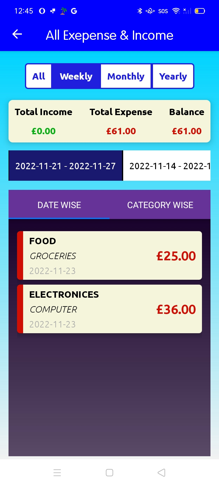

# MOBILE APPLICATION(FINANCE TRACKER)

I have Developed this app to keep track of our Dialy Expenses, Debts(Lend/Borrow) and savings(diposits/withdrawal) in one place,

to secure our app, I have implemented a login system, where user has to register with their email, which will help them to reset their password.
once user completes the registeration, they will be able to login and access the system. A token will be generated while logging in, using
that token, they will be able to access.So that, their data will be protected. which mean, every time, user tries to access the system with GET/PATCH/POST/DELETE operation, server will decide if the user is authenticated and has the right permission to access a resource

## APP LOADING

    

## LOGIN SYSTEM

### USER REGISTRATION

    

### USER LOGIN

    

###FORGET PASSWORD PROCESS

    
    
    
    
    

**Forget Password Email Template**

    
    

### HOME PAGE

    

## General Settings

** Setup your name and Currency **

    

## Daily Expense

    
    
    
    
    
    
    
    
    
    
    
    
    
    
    
    
    
    
    
    
    
    
    
    
    
    

## KEEP TRACK OF SAVINGS

    
    
    
    
    

